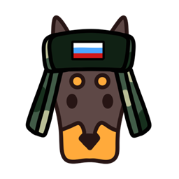

<div align="center">



# Русификатор Anymaker Demo

Неофициальный русификатор для игры **Anymaker** (Demo, **v0.0.26**).
Простое приложение с галочками: полностью переводит игру на русский — и так же возвращает оригинал.

</div>

---

## ✨ Возможности

- **Полная русификация интерфейса**: меню, настройки, подсказки, категории, тултипы, подсказки управления, ошибки скриптинга.
- **Перевод контента**: названия предметов, компонентов транспорта, существ и животных.
- **Выбор категорий галочками** — переводите только то, что нужно:
  - Интерфейс и меню
  - └ Модули микроконтроллера (блоки `если`, `повторить`…) — можно оставить **английскими**, что удобно для написания скриптов
  - Предметы
  - Компоненты транспорта
  - Существа и животные
- **Полностью обратимо** — кнопка «Вернуть оригинал» откатывает всё.
- **Автоопределение** папки игры (через стандартный путь и библиотеки Steam) + ручной выбор.
- Не требует установки — один `.exe`.

## 🚀 Установка и использование

1. Скачайте `AnymakerRussifier.exe` (в корне репозитория или во вкладке **Releases**).
2. **Закройте игру**, если она запущена.
3. Запустите `AnymakerRussifier.exe`.
4. Проверьте путь к игре (определяется автоматически; при необходимости нажмите **«Обзор…»**).
5. Отметьте нужные категории и нажмите **🇷🇺 Русифицировать**.
6. Запустите игру — изменения применяются при следующем запуске.

Чтобы вернуть оригинал — нажмите **↩ Вернуть оригинал**.

> ⚠️ Если игра в защищённой папке и появляется ошибка доступа — запустите русификатор **от имени администратора**.
> ⚠️ Это неподписанный `.exe`; Windows SmartScreen может предупредить — «Подробнее → Выполнить в любом случае».

## 📋 Что переводится

| Категория | Статус |
|---|---|
| Интерфейс и меню | ✅ переводится |
| Модули микроконтроллера (блоки) | ✅ опционально (галочка) |
| Предметы | ✅ переводится |
| Компоненты транспорта | ✅ переводится |
| Существа и животные | ✅ переводится |
| Руководство (внутриигровая книга) | ⚠️ остаётся английским — книга использует шрифт без кириллицы |
| Экран «Новая игра» (карточки режимов) | ⚠️ остаётся английским — текст зашит в бинарник игры |

## 🔧 Как это работает

- В `bin/game.gcl` меняется **один байт** активного языка (английский → русский). Перед записью проверяется сигнатура функции выбора языка — на другой версии игры байт не трогается.
- Подменяются файлы данных в `rom/`:
  - `rom/languages.tsv` — тексты интерфейса (русский — в колонке `ru`);
  - `rom/data/*.json` — названия предметов, компонентов, существ.
- Приложение содержит **обе версии** этих файлов (русскую и английскую), поэтому переключение работает в любую сторону независимо от текущего состояния.

## 🛠 Сборка из исходников

Требуется Python 3 (Windows) и PyInstaller.

```bat
pip install pyinstaller
build.bat
```

Готовый `.exe` появится в `src\dist\AnymakerRussifier.exe`.
Исходный код — в `src\russifier.py`, переводы — в `src\assets\`.

## ⚖️ Дисклеймер

Это **неофициальный фанатский** проект, не связанный с разработчиком игры Anymaker.
Оригинальные файлы данных игры в `src/assets/en/` включены исключительно для работы функции отката и **принадлежат разработчику игры**. Если разработчик возражает против их распространения — они будут удалены.
Используйте на свой риск; рекомендуется делать резервную копию папки игры. Steam «Проверка целостности файлов игры» всегда вернёт оригинальные файлы.

## 📄 Лицензия

Код русификатора и переводы — под лицензией [MIT](LICENSE).
Оригинальные ассеты игры под действие лицензии **не** подпадают и остаются собственностью правообладателя.
